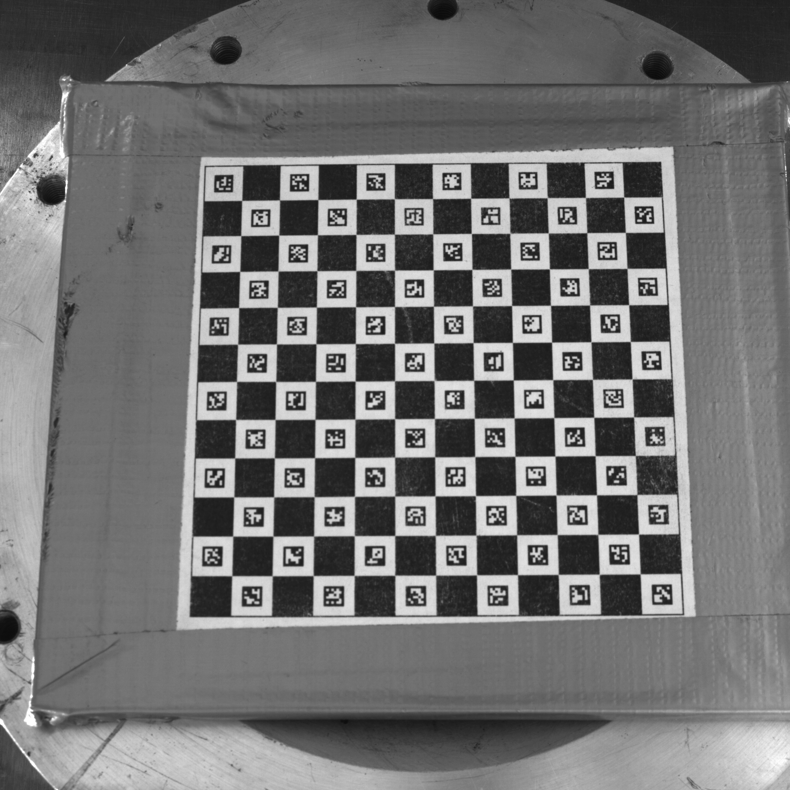
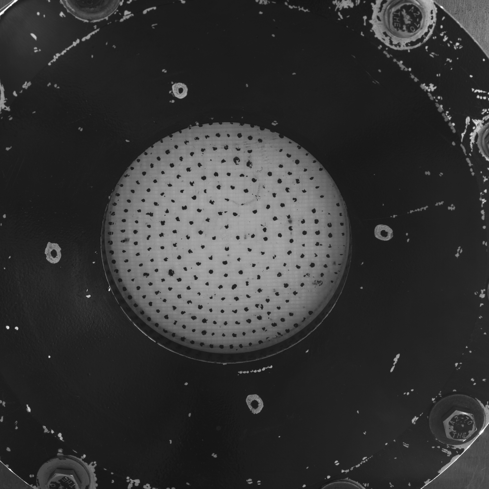
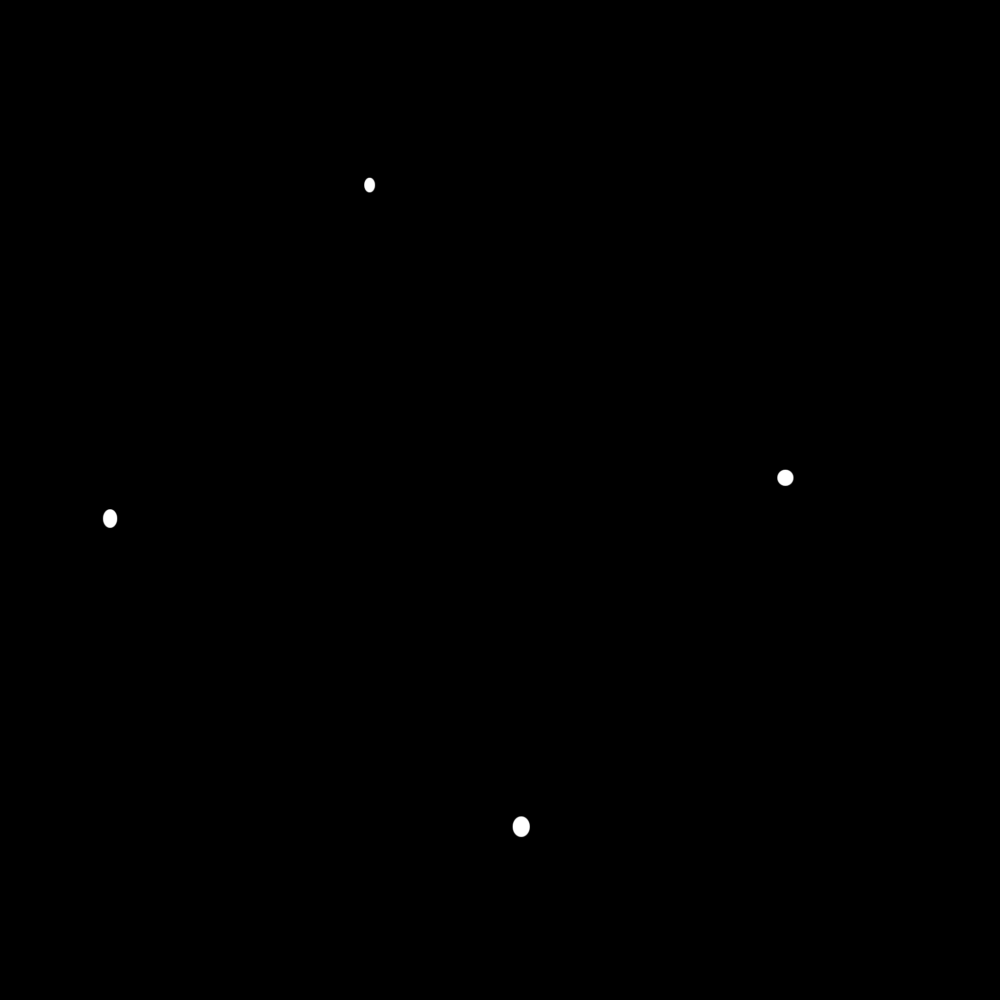
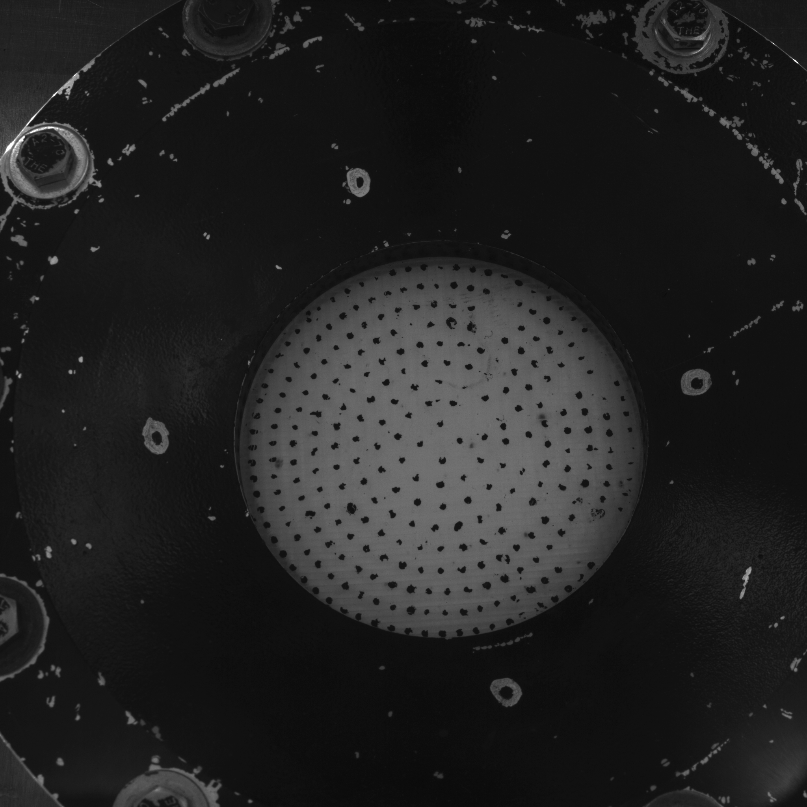
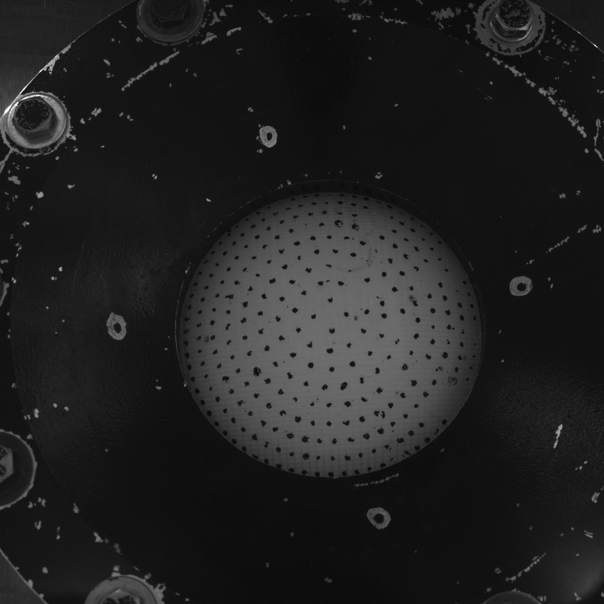
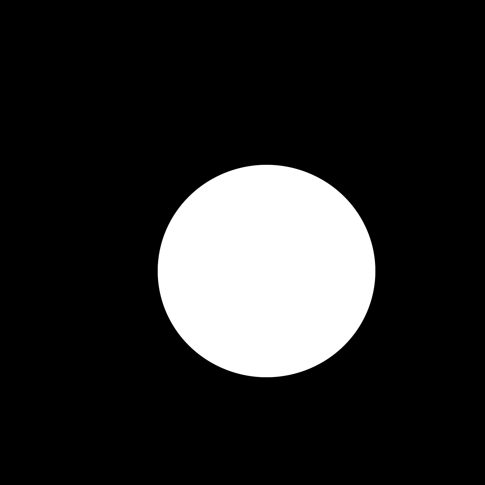
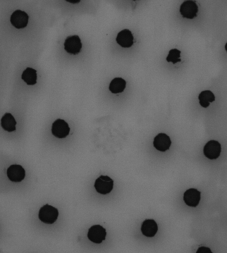
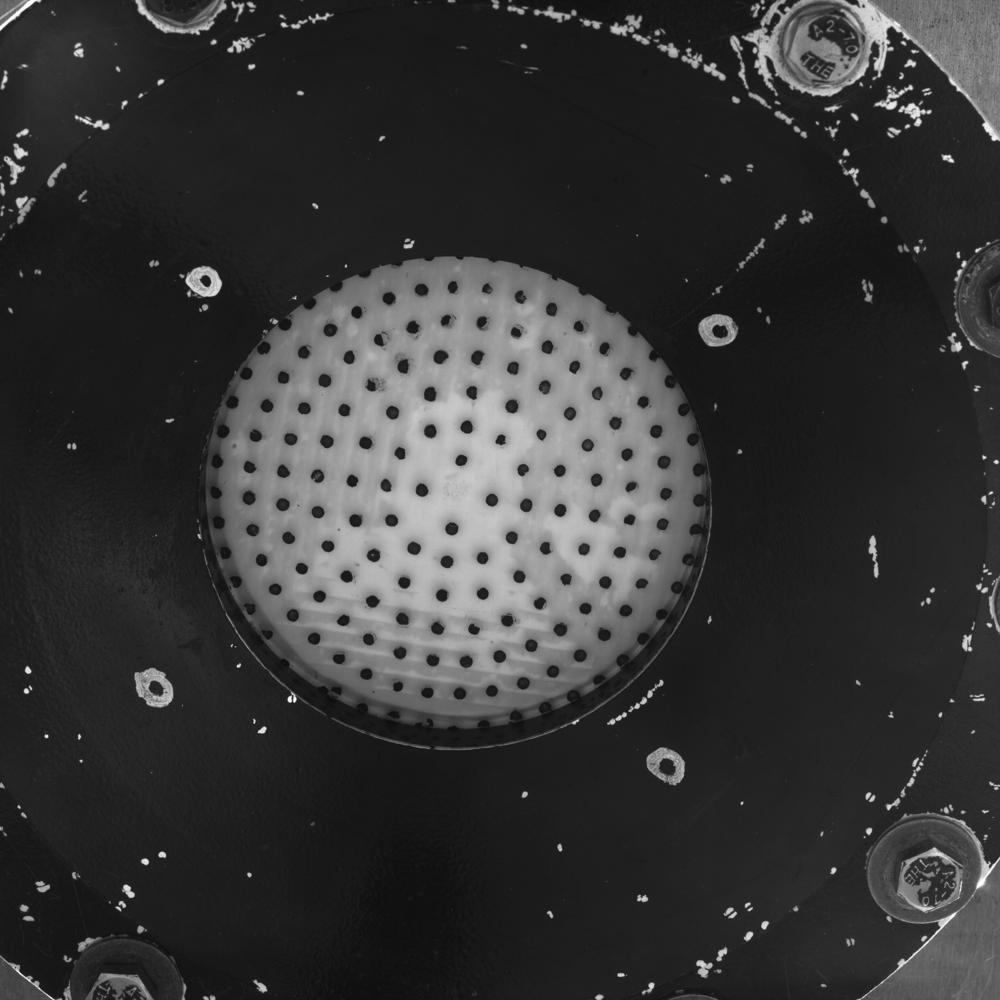

# Gonflement de prothèses de la paroi abdominale

Ce projet a pour objectif de réaliser des expériences de gonflement de prothèses de paroi abdominale. Il se décompose en deux parties : **l'expérience de gonflement** et **le traitement des données acquises**. L'étude du gonflement des échantillons, réalisé par un compresseur contrôlé via un débitmètre *Alicat*, se fait par vidéo-extensométrie, grâce à deux caméras _Ximea_ dont le déclenchement coordonné est assuré par un _FT232R_. La machine de gonflement en elle-même est une imprimante 3D.
Il se repose sur les bibliothèques [Crappy](https://github.com/LaboratoireMecaniqueLille/crappy) et [Pycaso](https://github.com/Eddidoune/Pycaso) respectivement pour le contrôle des instruments d'essais, et le traitement des données.


## Gonflement et acquisition des données
### Étalonnage par planche CHArUco
Les fichiers [ft232r.py](ft232R.py) et [moteur.py](moteur.py) permettent de contrôler le ft232R et l'imprimante.
Une fois les caméras, l'imprimante 3D et le ft232r connectés à l'ordinateur, écrire dans le terminal la commande 

```
echo 0|sudo tee /sys/module/usbcore/parameters/usbfs_memory_mb
```
 
pour libérer l'espace mémoire des caméras.

Ouvrir XiCamTool en écrivant :
```
/opt/XIMEA/bin/xiCamTool
```
Une fois la planche ChArUco placée, on peut alors la visualiser sur les deux caméras.

Dans python, écrire  : 
```
from serial import Serial

dev = Serial('./dev/ttyACM0', baudrate = 115200)
dev.write(b'G28 Z0\r\n')
dev.write(b'G0 X0 Y0 Z20\r\n')
dev.write(b'G0 X0 Y0 Z120\r\n')
dev.close
```
Cela permet de vérifier que la planche est visible et que les patterns sont nets pour les deux caméras entre 20 et 120mm


<p align="center"></p>

Lancer le script [calib_crappy.py](calib_crappy.py) pour prendre des images de la planche à des hauteurs successives. On visualise les hauteurs auxquelles sont prises les images. On s'assure d'avoir 21 images dans chaque dossier, et on supprime les meta-données.
Avec le script

```
from serial import Serial

dev = Serial('./dev/ttyACM0', baudrate = 115200)
dev.write(b'G28 Z0\r\n')
dev.write(b'G0 X0 Y0 Z70\r\n')
dev.close
```
placer le plateau en $z = 70mm$.

Lancer ensuite les scripts [calib_Lagrange.py](calib_Lagrange.py), [calib_Zernike.py](calib_Zernike.py) ou [calib_soloff.py](calib_soloff.py) pour effectuer l'étalonnage, selon les différentes méthodes prévues par Pycaso. Faire varier la valeur du polynôme et le nombre d'itérations de chaque méthode pour affiner les résultats. Cela permet de récupérer les coordonnées 3D théoriques et réelles de l'étalonnage, le nombre de points identifiés, les graphiques d'erreur de retropojection, ainsi que les constantes des polynômes d'interpolation.
Une fois cette partie achevée, éteindre l'imprimante.

Remarques : 
- Si les caméras ne s'ouvrent pas, les débrancher et rebrancher puis relancer le script.
- Mettre à jour la constante `date` dans chaque script.
- Vérifier le path et le nom des fichiers.

### Préparation de l'essai
Une fois l'échantillon placé dans la cellule de gonflement, lancer le script [camftdi_crappy.py](camftdi_crappy.py) avant le serrage, pour prendre une première image avec chaque caméra.
Créer un masque **GIMP** de chaque image en coloriant en blanc les 4 points noirs peints sur le mord.


 
  

Lancer [get_transfomatrix.py](get_transfomatrix.py) pour obtenir la matrice de passage de l'image de gauche à l'image de droite.
Serrer l'échantillon et le fixer sur la cellule de gonflement. Connecter ensuite le débitmètre à l'ordinateur, et relier le compresseur, le débitmètre et la cellule de gonflement. 

Remarques:
- Vérifier le nom des fichiers et des dossiers
- S'assurer que les caméras, le FT232R et le débitmètre sont connectés à l'ordinateur.

### Réalisation de l'essai

Lancer le script [alicat_flow_crappy.py](alicat_flow_crappy.py), qui définie la classe crappy du débitmètre, et lance le gonflement. Les fenêtres Videoextenso vont s'ouvrir : cela permet de piloter en vitesse de déformation le gonflement, ce qui n'est pour le moment pas réalisable (**À améliorer**). Sélectionner les 4 points centraux de l'échantillon puis fermer les fenêtres. Indiquer le type d'échantillon sur lequel l'essai est réalisé (***<typesilicone>_<typetricot>***)
Le script permet d'obtenir les images de l'essai pour chaque caméra, les données de vidéoextensométrie, et les données du débitmètre (pression, débit volumique, début massique).

   

Remarques : 
- Vérifier que le débitmètre et le FT232R sont bien connectés avec `lsusb` et modifier les noms des ports si nécessaire.
- Vérifier avoir bien récupérer deux dossiers avec le même nombre d'images.
- Faire attention aux constantes `date` et `sample`


## Traitement des données


### Transformation des points 2D en 3D

Créer un masque **GIMP** de la première image de chaque caméra dans les dossiers de l'essai, en coloriant en blanc la zone de l'échantillon. Cela définit la zone d'intérêt pour le traitement des données.


  

Dans **GIMP**, créer un fichier `Template_L.tiff` à partir de la première image de la caméra de gauche, en prenant le centre de l'échantillon, et créer une copie de la première image de droite en la renommant `Template_R.tiff`. Enregistrer ces deux documents dans le dossier '{date}/{sample}/'

 

Lancer le script [CoordCam.py](CoordCam.py) qui effectue l'identification et le suivi des points sur les deux caméras, en fonction du masque défini plus haut. Il permet des récupérer les coordonnées $x$ et $y$ de chaque point d'après la caméra de gauche, et d'après la caméra de droite, puis effectue une correction de ce suivi afin d'assurer l'appariement entre les points de gauche et de droite.

Lancer ensuite les scripts [detect3D_Lagrange.py](detect3D_Lagrange.py), [detect3D_Zernike.py](detect3D_Zernike.py) ou [detect3D_soloff.py](detect3D_soloff.py), selon la méthode d'interpolation voulue. Faire attention à prendre un degré polynomial correspondant à celui utilisé pour l'étalonnage.
Ces scripts appliquent une interpolation à ces points suivant la méthode d'interpolation choisie. On récupère alors les coordonnées 3D des points en chaque instant de l'essai, et on affiche leur position finale sur un graphique.

Remarques : 
- Veiller à garder cohérents le choix de la date, de l'échantillon, et du degré du polynôme entre chaque script.
- Il est possible d'ajuster les tailles minimales et maximales des points à détecter dans CoordCam
- Il est nécessaire d'ajuster manuellement l'appariement dans `CoordCam.py`. Pour cela on sert de matchTemplate de la bibliothèque [opencv](https://github.com/opencv/opencv) pour obtenir le décalage entre les images de gauche et de droite. Cette méthode n'est pas idéale, car elle ne prend pas en compte le changement de perspective, mais l'erreur est négligeable si l'angle d'orientation des caméras est faible.
- Dans `CoordCam.py`, on doit rentrer manuellement les coordonnées d'origine de `Template_L` à partir des valeurs indiquées dans **GIMP**

### Post-traitement et récupération des caractéristiques mécaniques

Lancer les scripts [getdef.py](getdef.py), [getaniso.py](getaniso.py) et [getuzpress.py](getuzpress.py) pour obtenir respectivement les déformations, la caractérisation de l'anisotropie de l'échantillon, et la courbe pression/UzMax.(**Scripts à revoir**)
